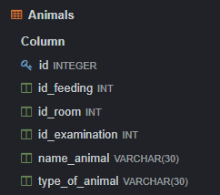
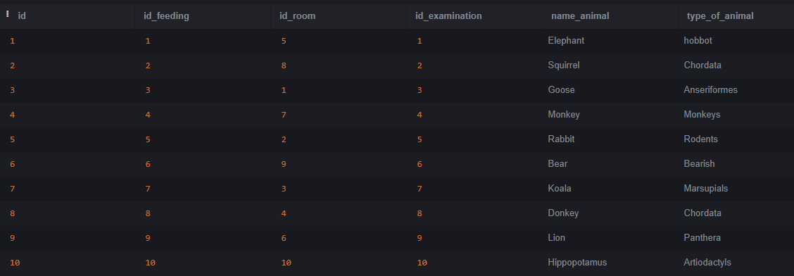
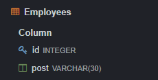
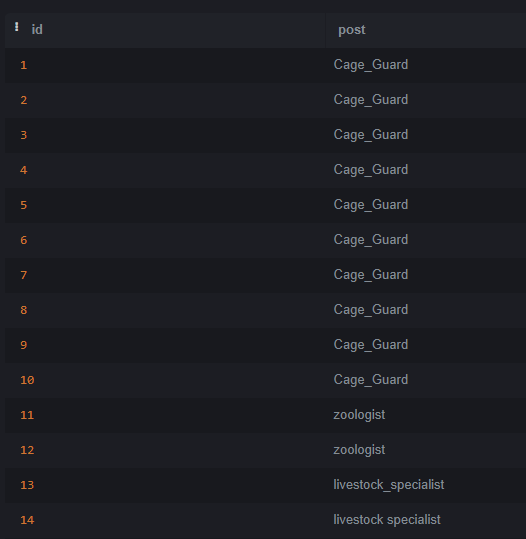
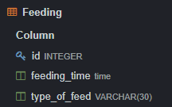
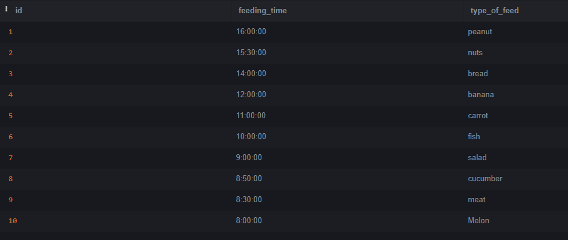
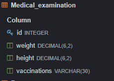
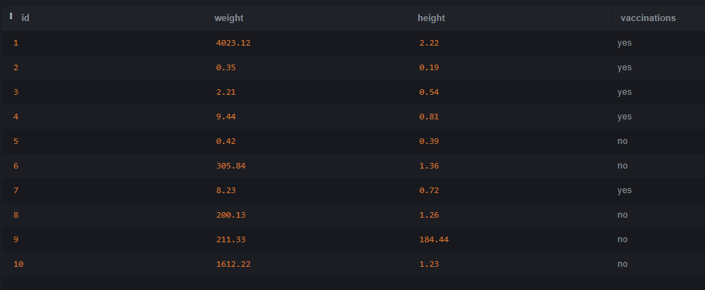
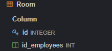
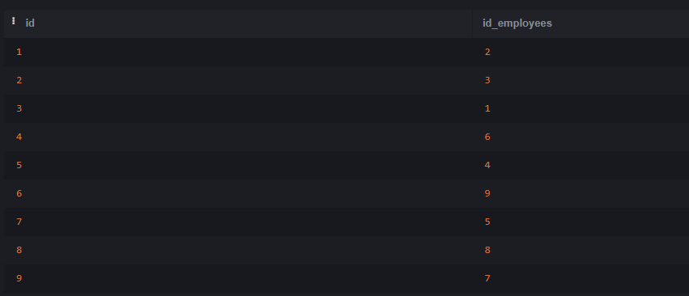

## 1.
 
  Исаев Динислам Абдулмуталимович, ИС 22/9-1

## 2.

Моя база данных про зоопарк
База данных имеет 5 таблиц

Таблица Animals (таблица хранит сведения о животных)

Таблица Employees (таблица хранит сведения о сотрудниках)

Таблица Feeding (таблица хранит сведения о корме животных)

Таблица Medical_examination (таблица хранит сведения роста, веста и о прививках животных)

Таблица Room (таблица хранит сведения о вольерах животных)

#### 2.1

Таблица Animals состоит из следущих атрибутов:
* id - создается по умолчанию, INT
* id_feeding - айди к таблице Feeding, INT
* id_room - айди к таблице Room, INT
* id_examination - айди к таблице Medical_examination, INT
* name_animal - название животного, VARCHAR(30)
* type_of_animal - тип животного, VARCHAR(30)

Таблица Employees состоит из следущих атрибутов:
* id - создается по умолчанию, INT
* post - должность сотрудника, VARCHAR(30)

Таблица Feeding состоит из следущих атрибутов:
* id - создается по умолчанию, INT
* feeding_time - время кормления животных, TIME
* type_of_feed - тип корма, VARCHAR(30)

Таблица Medical_examination из следущих атрибутов:
* id - создается по умолчанию, INT
* weight - вес животного, DECIMAL(6,2)
* height - рост животного, DECIMAL(6,2)
* vaccations - имеются ли прививки у животного, VARCHAR(30)

Таблица Room состоит из следущих атрибутов:
* id - создается по умолчанию, INT
* id_employees - айди к таблице Employees

	
	
		
	
  
